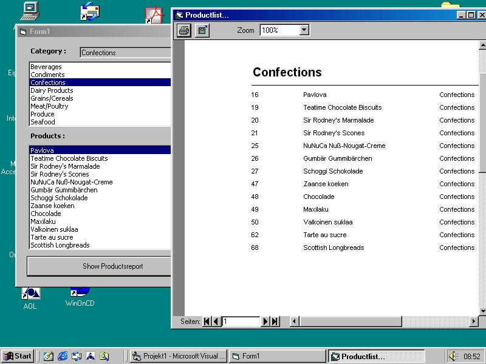



## DataReportDynamic

### Description

This Sample create's a Datareport by filtering a Database.

It is quit useful for small Reports.

(Sorry this is the Englisch Version!)
 
### More Info
 
This Sample create's a Datareport by filtering a Database.

It is quit useful for small Reports.

             |
---                |---
**Submitted On**   |2003-07-09 16:03:30
**By**             |[C\.E](https://github.com/Planet-Source-Code/PSCIndex/blob/master/ByAuthor/c-e.md)
**Level**          |Intermediate
**User Rating**    |5.0 (25 globes from 5 users)
**Compatibility**  |VB 5\.0, VB 6\.0, VBA MS Access
**Category**       |[Databases/ Data Access/ DAO/ ADO](https://github.com/Planet-Source-Code/PSCIndex/blob/master/ByCategory/databases-data-access-dao-ado__1-6.md)
**World**          |[Visual Basic](https://github.com/Planet-Source-Code/PSCIndex/blob/master/ByWorld/visual-basic.md)
**Archive File**   |[DataReport1612517102003\.zip](https://github.com/Planet-Source-Code/c-e-datareportdynamic__1-46774/archive/master.zip)

